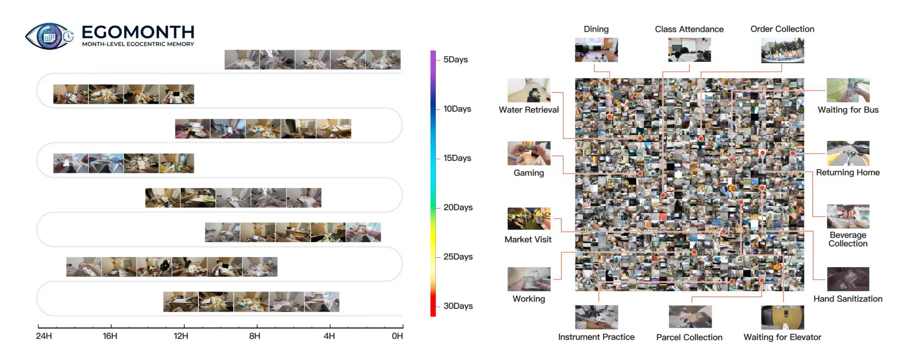
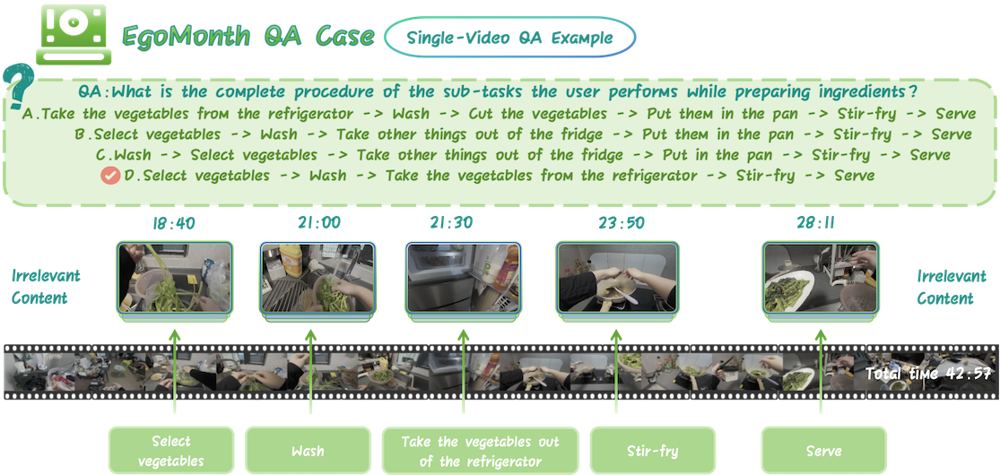
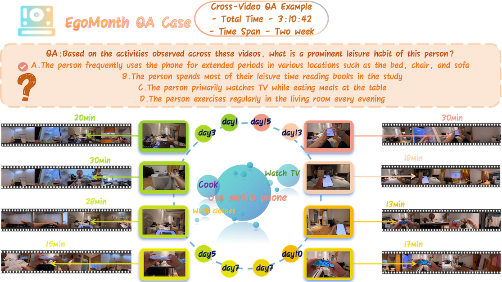
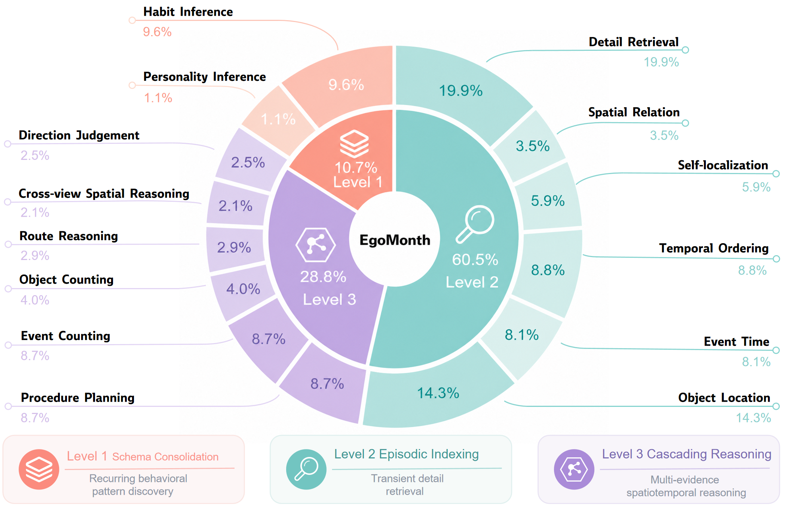
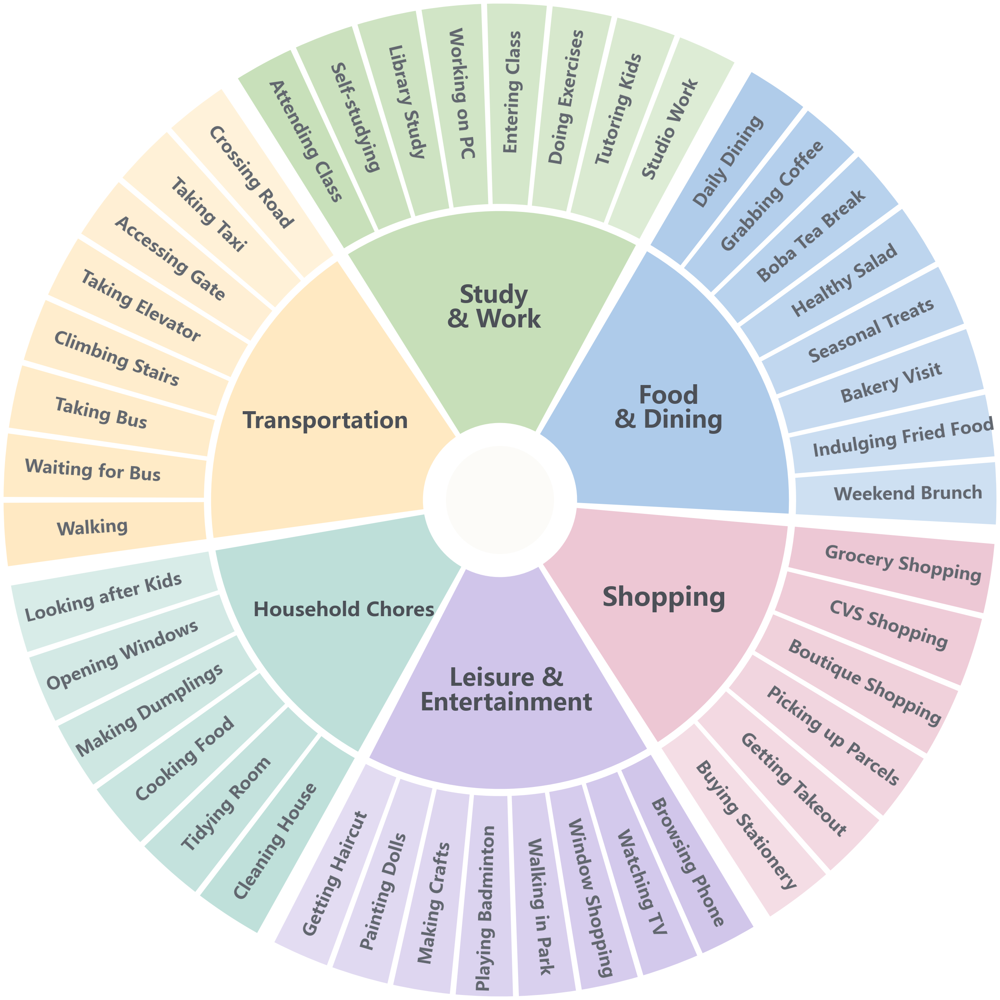

# EgoMonth

This repository hosts the project page and evaluation scripts for **EgoMonth: A Month-Level Egocentric Video Benchmark for Long-Term Spatiotemporal Memory**.

EgoMonth contains 301 hours of first-person daily-life video, 738 clips, 20 participants, 20-120 day recording spans, and 1,443 human-crafted multiple-choice QA pairs across 14 task types.

## Project Page

Open `index.html` directly or enable GitHub Pages from the `main` branch root. The page includes representative figures from the paper, including the dataset overview, single-video QA, cross-video QA, task taxonomy, and daily-life activity coverage.

## Representative Figures

### Dataset Overview



### QA Examples

Single-video QA:



Cross-video QA:



### Task Taxonomy



### Daily-Life Activity Coverage



## Repository Layout

```text
.
├── index.html
├── assets/
│   ├── styles.css
│   └── figure-*.png
└── scripts/
    ├── qwen2vl.py
    ├── qwen2.5vl_32b.py
    └── ...
```

## Evaluation Scripts

The `scripts/` directory contains model-specific evaluation scripts for the unified multiple-choice protocol, including Qwen2-VL, Qwen2.5-VL, Qwen3-VL, Qwen3-VL-30B-A3B, MiniCPM-V, LLaVA-NeXT-Video, Chat-UniVi, ST-LLM, VideoLLaMA3, VITA-1.5, and Gemini 2.5 Pro.

Each script constructs a video-grounded prompt and extracts one answer letter from `A`, `B`, `C`, or `D` for direct comparison with `correct_options`.

## QA Data Format

The Qwen scripts expect a JSON file containing a list of samples. Each sample should include:

```json
{
  "video_path": ["relative/path/to/video_1.mp4", "relative/path/to/video_2.mp4"],
  "question": "Question text",
  "options": ["A. ...", "B. ...", "C. ...", "D. ..."],
  "correct_options": "A",
  "task_type": "Detail Retrieval"
}
```

`video_path` can contain one video or multiple videos. The script joins each relative path with `CONFIG["video_root"]`.

## Running The Qwen2-VL Example

Install the main dependencies in an environment with CUDA:

```bash
pip install torch transformers qwen-vl-utils decord pillow numpy tqdm
```

Edit `scripts/qwen2vl.py` before running:

```python
DATA_PATH = "/path/to/EgoMonth/QA.json"

CONFIG = {
    "model_path": "/path/to/qwen2VL",
    "data_path": DATA_PATH,
    "video_root": "/path/to/video/root",
    "output_path": "qwen2vl_results.csv",
    "log_path": "qwen2vl_eval.log",
    "num_frames": 256,
    "max_new_tokens": 10,
    "device": "cuda:0"
}
```

Run evaluation:

```bash
python scripts/qwen2vl.py
```

The script writes a CSV file with `question`, `pred`, `gt`, `correct`, and `raw`, and a log file containing per-sample predictions and final accuracy.

## Running The Qwen2.5-VL-32B Multi-Subset Example

Edit `scripts/qwen2.5vl_32b.py`:

```python
DATASET_LIST = ["013", "023"]

CONFIG = {
    "model_path": "/path/to/qwen2.5VL_32B",
    "video_root": "/path/to/video/root",
    "num_frames": 256,
    "max_new_tokens": 10
}
```

For each dataset name, the script loads:

```text
/share/hjx/global_json_list/{dataset_name}/QA.json
```

If your metadata is stored elsewhere, update the `data_path` construction in `run_single_dataset`.

Run:

```bash
python scripts/qwen2.5vl_32b.py
```

## Citation

```bibtex
@misc{egomonth2026,
  title = {EgoMonth: A Month-Level Egocentric Video Benchmark for Long-Term Spatiotemporal Memory},
  author = {EgoMonth Team},
  year = {2026}
}
```
